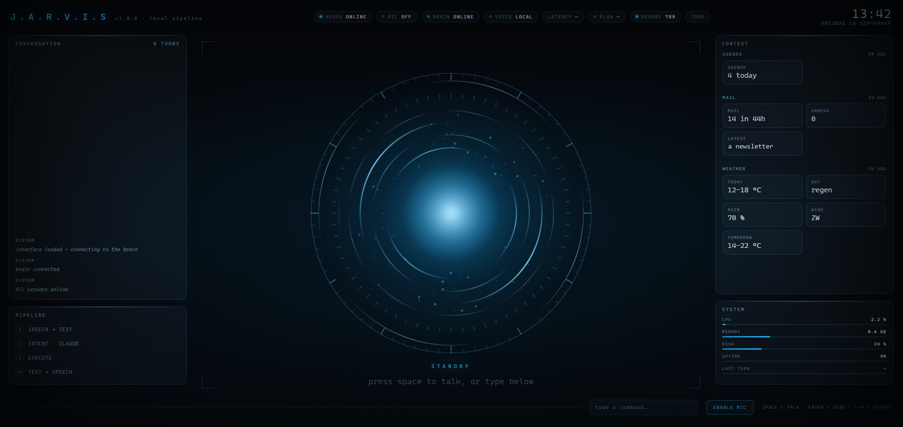
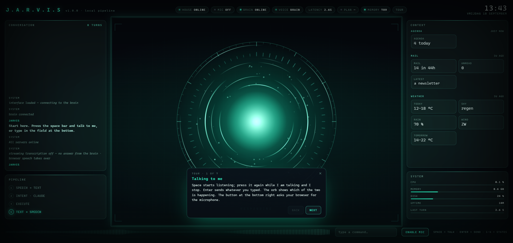

# JARVIS

A self-hosted, voice-controlled assistant for a house. It answers about it, acts on it, watches it on
its own, remembers what it is told, and — when something it is asked for does not exist yet — writes
it, tests it and asks to be restarted on it. Runs on a machine you own, behind a certificate you
control; nothing about the household leaves the network except the model, voice, weather and mail
calls.

It was built for one house and is written to be built for another. The parts that are somebody's —
the persona, the seeds, the credentials, the tools that talk to systems only one person has — live
outside this repository by design.





The screen at rest, and the same screen a minute later with the tour running. The transcript and the
four stages of the pipeline sit on the left, the context panel on the right holds the latest readings
of the agenda, the mail and the weather above the state of the machine, and in the middle is the
space where windows open when the assistant has something to show — a camera still, a chart, a note.
The orb changes colour with what it is doing; in the second picture it is listening, and the first
card of the tour says what the space bar, Enter and the button at the bottom right are for.

## Overview

The browser captures the microphone. The brain transcribes the audio, reasons about the house state,
acts on it, and speaks back. The HUD displays state, the transcript, and anything the assistant
chooses to show: camera stills, sensor readouts, charts, or notes.

Answers flow as they are thought — first text, then speech, sentence by sentence. The assistant
remembers what you tell it between conversations and can fetch details on demand. Anything that
secures the house (locks, alarm, door openers) requires a spoken confirmation before it runs, and
that confirmation is enforced in code rather than in a prompt: the tool that carries an action out
refuses unless the intent was registered in an *earlier* turn.

For the diagrams — a turn end to end, the confirmation state machine, the memory pipeline — see
[docs/architecture.md](docs/architecture.md). For running it — deploy paths, credentials, schedules
and what each dependency looks like when it breaks — see [docs/operations.md](docs/operations.md).

## What is core, and what is a pack

Core is what works on a machine with no smart device anywhere near it: the conversation, the memory,
the voice, the screen, the observation layer, and the machinery that lets the assistant extend
itself.

Everything else arrives as a **pack** — a directory under `packs/` with a manifest, an entry point, a
predicate that says whether this deployment has what it needs, and a `create` that returns MCP
servers, the tools to pre-approve, and its own paragraph of system prompt. No pack is in this
repository. Every one of them is a checkout of a repository of its own, named in a manifest and
installed by `npm run packs-sync`, which is what lets a pack be given away without handing over
everything around it.

No pack is published alongside core, and the manifest that ships here lists none. The ones this was
written against are somebody's house and somebody's credentials, and they stayed where they belong.
What is here is the shape, which is small enough to write against: a manifest naming the
repositories a deployment wants,

```json
{ "packs": [{ "id": "weather", "repo": "https://github.com/you/jarvis-pack-weather.git", "ref": "main" }] }
```

in `config/packs.json`, and in each of those repositories a `pack.json` and an entry point
exporting `configured()` — has this machine what the pack needs — and `create()`, which returns the
MCP servers, the tools to pre-approve, and the paragraph of system prompt that describes them.
`shared/src/pack.ts` is the whole of the contract, comments included, `brain/src/packs/loader.ts`
is what reads it, and
[examples/pack](examples/pack) is that contract as a directory you can copy: one setting, one tool,
one paragraph of prompt, and a README beside it for turning it into a repository of its own. It is
built and tested with everything else here, so it is the smallest thing known to still load.
[docs/packs.md](docs/packs.md) is the contract as prose, with the habits around it that no type
enforces and a checklist to build against.

A pack reads what it needs from `process.env` and never from core's configuration, so nothing has to
be edited here to run one.

The prompt describes the assistant that actually started. A deployment whose packs bring no mail
does not carry a paragraph about reading the mail, and does not offer a tool for it.

## The house, through an interface

Home Assistant is the only implementation shipped and stays the recommended one — it already speaks
to a thousand integrations. But nothing above `HomeProvider` in `shared/src/home.ts` knows that.
Seven methods are required: connect and close, what is here, what it reads, how to change it, how to
be told when it moves, and the latest reading. Four capabilities are optional and advertised through
a `capabilities` record: history, long-term statistics, cameras, calendars.

What a house without them costs is measured rather than guessed. A provider with none of the four
resolves the same watchlist, subscribes to the same live feed, fills the same buckets and builds the
same behavioural baselines. What it loses is the ten-day history backfill and every numeric
baseline — a fortnight of patience before the second learning loop is useful, not a broken
assistant. There is a test that says so in those terms.

## What it can do

**The house.** Answer from live state, with the attribute that actually carries the answer (a climate
entity's `current_temperature` rather than `cool`), from history, or from the house map its house
pack gives it. Act on lights, blinds, climate, media and scenes immediately; locks, alarm, door openers,
scripts, buttons, the water heater and garage or gate covers only after a spoken yes in a later
turn. A Jinja template tool is the escape hatch for everything the other tools do not cover.

**The day.** The weather for today and the days after. The agenda, from named Home Assistant
calendars — named, because a workday sensor is a calendar as far as Home Assistant is concerned, and
a briefing that opens by announcing that today is a working day is worse than one with no agenda in
it. Mail, read-only, with newsletters filtered out and a judgement about which messages want a
reply.

**The screen.** Anything worth looking at goes on the display surface where the orb sits: a camera
still or feed, an image it fetched, a sensor panel, a chart, a note. The browser never fetches a
source itself — everything is pulled server-side with whatever credential it needs and handed to the
page as an opaque path, so the house's token stays out of the browser. `show_camera` is only
registered when there is a house that says it has cameras: the assistant reads its tool list as a
list of promises, and a promise it discovers is empty halfway through an answer has already been
made out loud.

Each of those appears at the moment it is being talked about rather than the moment its tool
answered — a window may name a word to wait for, and is held until the voice reaches it. The one
before it does not disappear: it shrinks into a row underneath, four in view at most. A morning
briefing that covers the house, the mail and the agenda therefore ends with all three side by side,
in the order they were spoken.

**Itself.** What it noticed about the house and about its own jobs (`anomalies`), what earlier
conversations were about, what it remembers and why, what every model call cost, and what the last
attempt to extend itself did. The HUD's own panels say the same thing without being asked: one row
per tool server from the health probes, and the brain's memory, CPU, disk and uptime as measured
every few seconds. A reading that could not be taken is shown as an em dash — never as a zero.

**How it is built.** The system prompt carries a measured record of the deployment: which packs are
installed and which of those are running, off, broken, or not packs at all; for one that is off,
which of the variables it declared are empty and what each is for; whether core has the house
credentials, a voice, a written channel, an observation layer; and every tool server registered this
session. It is generated from the running process at startup, never written by hand, and it ends in
a rule — if a capability is not in that record, this deployment does not have it. The `my_setup`
tool answers with the same record plus every dependency asked, at that moment, whether it replies,
so "configured" and "reachable" are two answers rather than one. This exists because a machine with
no packs and no credentials, asked how to connect Home Assistant, said it was already connected: the
persona described a house assistant and nothing in the prompt contradicted it, while the pill on
screen read *not configured*. The assistant can now say which of the four installation steps has not
been taken, and is told not to name a pack or a repository that does not appear in its own record.

**Whatever is being talked about.** The context panel is a standing sheet, one block per subject:
the weather, the mail, the agenda, each replaced only by a newer reading of itself. Core notices
which server and which tool a turn is calling into and files the figures under the subject rather
than under the pack, so the house answering about the weather and the house answering about the
agenda are two blocks rather than one that keeps overwriting itself. This costs no tool call and
nothing about it is left to the model — the readings come out of the pack's own code.

A block goes up when JARVIS reaches its subject, not when its tool answered: the readings wait for
the word, glow gold as they land, stay marked for fifteen seconds and then go out slowly. The same
gold marks the row of a window he is talking about right now — out of a list of twelve mails, the
one the sentence is about. Nothing on the panel scrolls: it is trimmed to its column, so what falls
off the bottom is what the conversation has moved past. The sheet is kept in the browser, so
closing the page and opening it again picks the conversation up where it was.

**Explain itself, once.** The first time the HUD is opened it asks whether to show you around, and
takes no for an answer permanently; the button in the header runs it again. Seven steps name each
panel, say what the pipeline's milliseconds are, what an em dash on a meter means, and — from the
same health probes the pills use — what this particular install can actually reach. It is a script
in the page, not a conversation: no model is asked anything, so it works identically with no packs,
no house, no microphone and no API key, which is the machine most likely to need it. What it cannot
show it leaves out rather than describes.

## What it remembers, and how it learns

Continuity is a memory layer, not a long context window. A conversation lasts twenty minutes or
thirty turns and is then dropped; everything meant to survive that is written down. The store is one
SQLite file with full-text search and a vector column.

**In the prompt, every turn.** The persona, a small core of facts, a map of the house — when a house
pack supplies one — naming what a spoken question reaches for against a character budget, and up to
eight *recipes*. Everything else is
looked up.

**Volunteered, before a tool is called.** The question is embedded locally and the facts it already
reaches for ride along with it — at most three, above a deliberately high similarity floor, framed as
a hint it may ignore. Without this, a question pays a tool round trip to learn something the database
would have offered for seven milliseconds of CPU.

**On demand.** `recall` merges a full-text hit with a vector sweep, so "wat was er mis met de
wasdroger" finds the fact that says *droger*. `conversations` is the separate log of what was
discussed rather than what is true — the thing that answers "waar hadden we het gisteren over".
`remember` and `forget` are the direct route when the owner says something worth keeping, or says it
is wrong.

**After the conversation ends.** A cheaper model reads the whole transcript once and does two things:
it proposes durable facts — preferences, people, habits, running concerns — and writes one or two
sentences about what the conversation was about. Per conversation rather than every few turns,
because a conversation is the smallest unit that makes sense of itself, and out of the answer's way
because deciding mid-sentence what deserves remembering makes it slower and more long-winded.

**Weekly, on a stronger model.** Consolidation rereads the entire fact table and proposes repairs:
merge duplicates, resolve contradictions, drop what has gone stale, promote or demote what belongs
in the core. Deliberately conservative — every proposed operation is validated against the facts that
really exist, and losing something the owner said is worse than leaving redundancy in place. How
often a fact was looked up is a signal, never a proof.

**Recipes, from its own tool calls.** Every turn records which tools it used and with what. The same
weekly pass reads three weeks of that back and writes down the patterns that keep resolving to the
same call — that "hoe warm is het boven" means one particular sensor and not the thermostat. Hints,
not rules, replaced wholesale each pass, so a pattern that stops recurring stops being suggested.

**Nightly, from the owner's own notes.** Everything worked on with a coding agent leaves a note
behind. Those notes are rewritten by a cheap model into facts *about* the household, because a note
is written at an agent ("use parse_mode html") and an assistant that recites one sounds like a
runbook. A note may only claim a subject that is free or already owned by a note, so it can never
overwrite a curated seed or something distilled from a conversation — and when a note disappears, its
facts go with it unless another note vouches for them.

**Seeds.** The curated kernel in `config/seeds/*.json`, imported with
`brain/dist/memory/import-cli.js`. Idempotent, upserted on subject and kind, and never overruled by
a note. There is a starting point in [examples/seeds/](examples/seeds/).

**Corrections are cheap.** Every change to a fact keeps a revision, so a wrong distillation can be
read back and restored from the HUD's memory panel, which is gated by `JARVIS_MEMORY_PANEL`
(`off`, `read`, `edit`). It ships at `read`: restoring a revision is a write, and writes wait until
the port is somewhere only you can reach.

**Everything is metered.** Every call to a model — turn, distillation, consolidation, recipes,
ingest — writes a row with its tokens and cost, readable with `node dist/usage-cli.js`.

```bash
cd brain
node dist/memory/import-cli.js              # load the curated seeds from config/seeds
node dist/consolidate-cli.js                # run the weekly pass by hand
node dist/memory/corpus-cli.js              # ingest the notes now
node dist/usage-cli.js                      # what the model has cost
node dist/prompt-size-cli.js                # what the system prompt currently weighs
```

## Building on itself

Ask for a capability that is missing — or watch it run into the gap on its own — and it can close it.
What happens next depends on a verdict it does not get to make about itself.

A **small fix** is written here. A `git worktree` is cut from `origin/main` so the live checkout is
never edited in place, and a worker is started in it with five tools: read, write, edit, glob, grep.
No shell, deliberately — the SDK confines file tools to the working directory, so a worker without
`Bash` cannot reach the network, a key, or anything outside its own throwaway directory. Everything
else is done by the pipeline around it: it runs the suite, feeds a failure back into the same worker
once, commits, pushes, opens a pull request and sends the link out. The worktree is thrown away
either way. While it works, `dev_steer` passes a correction into the attempt that is already running,
and `dev_status` says what is in flight, what is waiting for a yes, and how the last one ended.

Both endings are reported the moment they happen, because a fix runs for up to a quarter of an hour
and silence otherwise looks the same as work in progress. A failure is spoken out loud by whichever
HUD is open — one sentence, after any answer in progress has finished — and written to whatever
channel the deployment has, with the last lines of the run that ended it. There are two written
routes and a deployment may have either, both or neither: one through the house's own messaging,
and one that is a plain POST to a URL, for a machine with no house. Those lines are kept on the
task as well, so `dev_status` can still answer "waarom ging dat mis" the next morning.

Anything **too big** is handed to whatever a pack offers as a `Delegate`. With nothing offered — the
default — the verdict is written down and said out loud, which is what a capability gap already does.
A gap worth recording but not worth building now is written down the same way and left there.

Which of the two it is comes from `brain/src/dev/guard.ts`, from a described shape — which
repository, which files, does this need a package, a secret, another machine — and never from asking
the model whether something is small. The verdict is carried through the spoken confirmation rather
than recomputed, and the diff that actually happened is checked against the same rules before a pull
request exists. A change that touched a protected path is deleted rather than reviewed.

Protected paths are not the risky-looking ones; they are the ones that move the boundaries: the
house's confirmation guard (it lives in a pack, so `packs/` covers it), this machinery and its tests, `scripts/`,
`deploy/`, `.github/` and the dependency manifests. Removing the alarm's spoken confirmation is a
one-line diff and is exactly the change that may never be small.

Numbers instead of judgement: four files, five fixes a day, one at a time, fifteen minutes each.

On a copy of this repository, self-development needs somewhere of its own to push. The pipeline
pushes the branch to `origin` and opens the pull request on `JARVIS_GITHUB_REPO`, and a checkout
cloned from here has an `origin` it may not write to. Point it at your own copy —
`git remote set-url origin git@github.com:you/jarvis-core.git` — and name that same repository in
`JARVIS_GITHUB_REPO`, with a fine-grained token in `GITHUB_TOKEN_JARVIS`. Whether the push will be
accepted is asked before the work rather than after it, so a remote that refuses costs a second
instead of a quarter of an hour and the commit that was written in it.

Merging is a second spoken yes, in a later turn, on a pull request that is already green. The brain
then writes the merged commit hash into `data/deploy-request` and stops. It cannot restart itself —
its unit runs with `NoNewPrivileges` — so a path unit picks the file up and a root one-shot
(`scripts/self-deploy.sh`) refuses anything that is not already an ancestor of `origin/main`, runs
the suite again, restarts the service and rolls the checkout back if any of that fails. The result
lands in `data/deploy-result.json`, because by then the process that asked for it is gone.

## Watching the house

With `JARVIS_PROACTIVE=observe` the brain keeps a connection open to the house and builds its own
picture of normal. Nothing here calls a model: detection is deterministic code, and the house is
read-only — acting on a finding still goes through the spoken confirmation.

- **Rollup**, every five minutes: how long each watched entity was on, written sparsely, with a
  coverage row so a gap in the data is not mistaken for a quiet house.
- **Baselines**, nightly at 03:50 local: median and median absolute deviation per weekday and hour
  over eight weeks of statistics, and an on-fraction per weekday and hour for behaviour.
- **Rules**, hourly at six past: a reading far from its baseline (modified z-score), an expected event
  that did not happen, a sensor that has stopped moving or gone unavailable, and a problem-class
  sensor that is active.
- **Self checks**, hourly alongside the rules and independent of them, because the evening the house
  cannot be reached is exactly when they matter: a scheduled job that has not reported in or whose
  last run failed, and invariants about the assistant's own state — counts that do not shrink, an
  observation feed no more than fifteen minutes stale, a working copy matching what was pushed, a
  time zone that was actually chosen. A reading that could not be taken is no opinion, never an
  alarm, and neither is a decision: a timer this machine never enabled is not a broken timer, and a
  job with no timer and no history is not a job that failed to run. What is a fault is a timer that
  is enabled and not armed, and configuration that is half done — a house URL with no token.
- **Asking**, at `JARVIS_PROACTIVE=suggest` and only with a bot token configured: a condition that
  has held long enough goes out as a chat message with three buttons under it — right, noise,
  later — and the press is written down next to what was sent. That table is the point of the
  exercise. Rules can be tuned against recorded hours, and have been; recorded hours cannot say
  whether a true reading was a welcome one, and only the person who read the sentence can. Four
  restraints, all counted before anything is rendered: nothing is offered twice, nothing about a
  subject that has been put away, nothing at all inside the quiet hours, and never more in a
  rolling day than the cap. `later` puts the subject away for a week, so a condition that closes
  and reopens an hour later does not walk around it.
- **In the reader's language**, taken from `JARVIS_LOCALE`. Rules write English prose for the
  record and a key with the values beside it; `brain/src/proactive/phrases.ts` holds the wording
  per language, and anything it does not have falls back to the English.
- **Brakes**, all in code: one open row per condition, persistence before a condition counts, a
  cooldown before a resolved one may reopen, and a daily cap per rule. Over two days of a real house
  this turned several hundred findings into a couple of dozen rows; `brain/src/proactive/detect.ts`
  carries the exact figures next to the code that produced them.

It does not speak first about the house yet — ask "is er iets bijzonders?" and it answers from what it
noticed. Findings land in the `anomalies` table and are read back through `mcp__insight__anomalies`,
which is registered only at `observe` or above.

```bash
cd brain
node dist/anomaly-cli.js              # what is open right now
node dist/anomaly-cli.js baselines <subject>  # a subject as a 7x24 grid
node dist/anomaly-cli.js dry-run 48   # replay real hours through the rules, writing nothing
```

Behavioural baselines can only be built forward — the recorder keeps ten days — so the subsystem
needs a couple of weeks of running before its judgement is worth much.

## Workspaces

This is a TypeScript monorepo:

- `brain/` — Node 22 service handling transcription, agent logic, the memory, the proactive watcher,
  self-development, the pack loader, and the websocket server that drives the HUD.
- `hud/` — Browser front-end rendering the display, microphone capture, audio playback, and the
  canvas where the orb sits. Today that is one self-contained file, `hud/public/index.html`, with
  its styles and script inline: the page loads off the static server with nothing built. `hud/src/`
  is the workspace that file gets taken apart into when it has earned it, and holds one empty entry
  point until then.
- `shared/` — Types shared between brain and HUD: the websocket protocol, the house seam, the pack
  contract, the delegate seam.
- `packs/*` — Where packs are installed, each one a checkout of its own and none of them tracked
  here. They are deliberately *not* workspaces: a lockfile that named them would name somebody's
  private packs, and `npm ci` refuses to run at all once a directory on disk is missing from it.
  What they import resolves upwards into the root `node_modules` instead, so a pack may use what
  `brain` already depends on and must otherwise bring its own.

The tool servers are in-process MCP rather than child processes: an external server was three of the
nine seconds a spoken question used to take.

## The language it speaks

Dutch, and not by configuration. The example persona, the four prompts behind the nightly
and weekly passes, the packs' own prompt paragraphs and the tool descriptions are written
in it, and `SpeechLang` offers Dutch and English only. The persona is replaceable; the rest
would have to be translated.

That is a deliberate position rather than an oversight, but it is worth knowing before you
install this expecting it to speak yours.

The clock is a different matter and is not baked in: see `JARVIS_TIMEZONE` and
`JARVIS_LOCALE` below. Set the zone before the proactive side has run for a fortnight,
because what it learns about a Tuesday evening is only as good as its idea of an evening.

## Configuration

The brain reads environment variables at startup. Nothing here is required to start: an unconfigured
capability is simply not offered.

| variable | what it does |
| --- | --- |
| `HA_URL`, `HA_TOKEN` | The house the observation layer watches. Empty leaves the assistant with no house at all, which works: nothing is observed, and the checks it makes on itself run on the same hour regardless. The `hass` pack reads the same two for its tools. |
| `JARVIS_OWNER` | What to call the person the assistant belongs to, in the prompts the persona does not reach. Unset, they say "de gebruiker". |
| `JARVIS_NOTIFY_ENTITY`, `JARVIS_NOTIFY_SERVICE`, `JARVIS_NOTIFY_DATA` | A written notice through the house: which entity, which service (`notify.send_message` by default — the generic one every notify entity answers), and a JSON object of extra arguments for messaging that wants a parse mode, a topic or a priority. |
| `JARVIS_NOTIFY_WEBHOOK`, `JARVIS_NOTIFY_WEBHOOK_BODY`, `JARVIS_NOTIFY_WEBHOOK_CONTENT_TYPE`, `JARVIS_NOTIFY_WEBHOOK_HEADERS` | A written notice that needs no house: a URL to POST to. `{{json}}` in the body is the notice as a quoted JSON string, `{{text}}` is it raw. Both written routes may be set at once; neither set leaves the spoken channel alone. |
| `ELEVENLABS_API_KEY` | The ElevenLabs voice, for speaking and for transcribing. Transcription is ElevenLabs only: Fish transcribes files, not a live microphone. |
| `JARVIS_VOICE_ID`, `JARVIS_VOICE_ID_EN` | Which ElevenLabs voice speaks; empty English means one voice speaks both. |
| `FISH_AUDIO_API_KEY` | A second voice, from Fish Audio. Its `s2.1-pro-free` model has no character cap and costs nothing, where the free ElevenLabs tier runs out after ten minutes of speech a month; what it gives up is per-character timing (the transcript is paced by the audio's length instead), latency guarantees, and the promise not to train on what it is sent. |
| `JARVIS_VOICE_PROVIDER` | `elevenlabs` or `fish`: who speaks when both keys are given. Unset, whichever key was given speaks, and ElevenLabs when both are. |
| `JARVIS_FISH_MODEL`, `JARVIS_FISH_VOICE_ID`, `JARVIS_FISH_VOICE_ID_EN` | Which Fish model (`s2.1-pro-free` by default; `s2.1-pro` is the same model with guarantees, paid per byte) and which Fish voice reads Dutch and English. Empty voices leave Fish's own default. `JARVIS_FISH_ENDPOINT` moves the socket, for a proxy or a test; nothing else needs it. `JARVIS_FISH_LATENCY` is `normal` (the sentence is synthesised whole, stress and melody right, first audio after about three seconds) or `balanced` (a second to the first word, at the prosody's expense); `JARVIS_FISH_NORMALIZE` (on) has Fish write numbers and times out before reading them. |
| `JARVIS_VOICE_STABILITY`, `JARVIS_VOICE_SIMILARITY`, `JARVIS_VOICE_SPEED` | How the voice reads: even against expressive, how closely it holds its own timbre, and its pace. Fractions, defaulting to `0.4`, `0.75` and `1.0`. |
| `JARVIS_VOICE_TIMBRE` | How far the browser colours the voice, `0`-`100`. `0` is the voice as it came. Filtering happens in the page, so it costs no credit and no latency. |
| `JARVIS_SPEECH_LANG` | The language this deployment is spoken to and answers in: `nl` (default) or `en`. It decides which of the two voices above reads an answer, which language the microphone is transcribed as, and what a line put through `say` is spoken in when the caller names no language of its own. It translates nothing: what the assistant writes is the persona's business, and a persona that writes Dutch while this says English will be read out with an accent, so the two are set together. |
| `JARVIS_MEMORY_PANEL` | `off`, `read` (default) or `edit` — how much of the memory the HUD may see and change. Not `edit` by default on purpose: the control surface has no authentication of its own, so anything that reaches the port would be able to rewrite and delete what the assistant knows. |
| `JARVIS_TIMEZONE`, `JARVIS_LOCALE` | The zone every weekday, hour and spoken time is worked out in, and the language dates and numbers are written in. Unset, the zone is the machine's own and the locale is `nl-NL`; the zone in use is printed at every startup. Getting this wrong is silent — a behavioural baseline still builds, it is just about different hours — so a machine whose clock is UTC while the house is not opens a finding about itself until the zone is named. |
| `JARVIS_PORT`, `JARVIS_CERT_DIR` | Where it listens, and the TLS certificate and key. |
| `JARVIS_MEMORY_PATH`, `JARVIS_DATA_DIR` | The memory database, and the runtime state around it. |
| `JARVIS_BACKUP_DIR`, `JARVIS_BACKUP_KEEP` | Where nightly copies of the memory go, and how many are kept. |
| `JARVIS_CORPUS_DIR` | Where the copy of the owner's own notes lands, for the nightly ingest. |
| `JARVIS_PROACTIVE` | `off` (default), `observe`, `suggest`, `announce`. A ladder: each step includes the ones before it. At `off` no connection is opened and no timer armed. |
| `JARVIS_TELEGRAM_TOKEN`, `JARVIS_TELEGRAM_CHAT` | The bot findings are put to, and the one chat whose answers -- and questions -- are taken. A message typed at the bot is answered as an ordinary turn, so this is a second way in as well as a way out. Both empty leaves `suggest` with nothing to say: everything is still detected and written down, and nobody is asked about any of it. Telegram because a long poll needs no inbound port, no domain and no certificate. |
| `JARVIS_SUGGEST_PER_DAY`, `JARVIS_QUIET_FROM`, `JARVIS_QUIET_TO` | How many findings may be put in a rolling day (6), and the local hours nobody is to be spoken to in (21 to 7). Equal hours mean never quiet. |
| `JARVIS_SESSION_IDLE_MIN`, `JARVIS_SESSION_MAX_TURNS` | When a conversation is dropped (20 minutes, 30 turns). |
| `JARVIS_MODEL`, `JARVIS_ESCALATE_MODEL` | What turns run on (`sonnet`), and what a turn is raised to once a tool has failed or building work has started. Empty escalation keeps every turn on the one model. Raising is per turn and mid-turn: the answer that follows a failed tool call is the one that gets the stronger model, and the next ordinary question goes back. |
| `JARVIS_FALLBACK_MODEL` | Tried when the primary model is overloaded. The primary is retried at the start of every turn, so an outage does not demote the conversation for good. |
| `JARVIS_MAX_STEPS`, `JARVIS_MAX_TURN_USD` | Brakes on a single question: how many steps it may take (16; `0` removes the limit) and what it may cost in dollars (`0`, meaning no limit). A turn that trips one is answered with the stopped sentence and the conversation continues. |
| `JARVIS_STOPPED_SENTENCE` | What is said when a brake stopped a turn. Spoken, so it belongs to the deployment's language. |
| `JARVIS_LIMIT_SENTENCE`, `JARVIS_PLAN_WARN_PCT` | What is said when the claude.ai plan is spent, in place of the SDK's own line about weekly limits; `{reset}` becomes the hour the window opens again, or a weekday and an hour, and the sentence carrying it is dropped when that is not known. From `JARVIS_PLAN_WARN_PCT` (75) of a window onwards the model is told, ahead of each question, to economise and to say nothing about it. The HUD's Plan pill shows both windows as percentages, or the binding one when only that is known. |
| `JARVIS_THINKING_LINES`, `JARVIS_THINKING_AFTER_MS` | What is said while a slow turn is still fetching, and how long it may work in silence first (2000 ms). Written as one line separated by `|`, because these are sentences and a comma belongs inside one; one is picked at random, never the same one two turns running. They are recorded once by the configured voice at startup and kept as PCM under `data/voice-lines/`, keyed on voice, model, speed and words, so a slow turn is acknowledged from disk while the voice's socket makes the first sentence of the answer; change the voice and they are recorded again. The clock runs from the question, restarted by every word the assistant says before the answer proper begins, and stopped for good by the first word it says about what a tool came back with. So a question answered straight away never hears any of this, and a greeting followed by twenty seconds of fetching does. An empty list, or zero, turns it off. Spoken, so they belong to the deployment's language. |
| `JARVIS_DEV_REPO`, `JARVIS_DEV_WORKTREES` | The checkout self-development branches from, and where its throwaway worktrees are made. The latter must be in the unit's `ReadWritePaths`. |
| `JARVIS_GITHUB_REPO`, `GITHUB_TOKEN_JARVIS` | Repository and fine-grained token used to open and merge pull requests. Contents and pull-requests write on that one repository, nothing else. Without the token everything up to the push still works. |
| `JARVIS_COMMIT_EMAIL` | The address a self-written commit is authored with. Unset, git's own configuration decides. |
| `JARVIS_RUNNER_TOKEN` | The bearer token a machine running delegated jobs reports quiet panes with, at `POST /runner/report`. Empty, the route does not exist at all: a delegated slot then stays open until somebody closes it by hand, which is the behaviour of a deployment that delegates nowhere. |
| `JARVIS_WATCH_IGNORE_PLATFORMS` | Integrations the watcher ignores outright, as the entity registry spells them, comma-separated. A vehicle integration and outdoor cameras are the usual entries: a sleeping car reports every door unavailable, and rain on a lens is motion. Empty watches everything. |
| `CLAUDE_CODE_OAUTH_TOKEN` | Subscription OAuth token from `claude setup-token`. Never set `ANTHROPIC_API_KEY` in the same environment; the SDK prefers it and billing switches to per-token. |

A pack reads its own settings, straight from the environment: they are set in the same env file and
they are not listed here, because a pack this repository does not carry cannot be documented by it.
Its own README has the table.

### What stays yours

`config/` and `packs/` are ignored here, and `scripts/check-no-house-facts.sh` additionally
fails if anything under them is *tracked* — because an ignore rule stops being consulted for a file
git already knows about, so one `git add -f` or a `git mv` into an ignored directory would publish
it without a word. The check counts paths; it never reads what is in them.

That boundary is also what keeps a private capability private while still being part of the
assistant. A pack contributes its own tools, its own health probe and its own
paragraph of system prompt, so a deployment can teach JARVIS something nobody else's copy knows
about without a line of it living here. Where that capability lands in a routine belongs in
`config/persona.md`; what it is and how it works belongs in the pack.

Because a pack is a checkout of its own, nothing here scans inside it — and a pack has no denylist
and usually no CI, which left the one mechanism that keeps a household out of a public repository
stopping exactly where the repositories most likely to be published begin. The check takes a
`--path` for that: `./scripts/check-no-house-facts.sh --path packs/<pack>` scans that checkout
with this deployment's list. Only the mechanism is shared; the words are read from beside the script
and stay here.

## What a deployment owns

Six things are yours rather than the repository's, and git does not carry them:

| path | what it is |
| --- | --- |
| the env file | the credentials above, read by systemd from somewhere root-readable |
| `config/persona.md` | who the assistant is and who it is talking to. Copy [examples/persona.md](examples/persona.md) |
| `config/seeds/*.json` | the first facts. Copy [examples/seeds/](examples/seeds/) |
| `config/packs.json` | the packs this deployment runs. [examples/packs.json](examples/packs.json) is read first and lists none; an `id` in both replaces the shipped entry rather than adding a second, so a fork or a branch can be pinned without restating the rest |
| `data/` | the memory database, its backups and the corpus — everything the assistant has learned |
| `packs/` | the packs themselves, each a checkout of its own, ignored by this repository |

Without a persona the assistant starts on a short built-in one and says plainly that nobody has given
it a character yet. That is deliberate: better than a repository that will not start, and much better
than one that pretends to a household it knows nothing about.

Two consequences worth reading twice, because both destroy the list above without an error message:

⚠️ **`git clean -x` deletes all six.** They are ignored, which is exactly what `-x` is for. Use
`git clean -fd` without `-x`, or nothing at all.

⚠️ **A fresh clone carries none of them.** Pulling into an existing checkout is safe and touches
nothing on the list; cloning to a new host produces an assistant with no character and no memory.
Moving hosts means copying the six by hand — see the fresh-host checklist in
[docs/operations.md](docs/operations.md).

The nightly backup timer covers `data/memory.db` alone. The env file, the persona, the seeds and
`config/packs.json` are not backed up by anything here; put them wherever the host's backups go.
`packs/` needs no backup of its own, because every pack in it is a clone of a repository
somewhere else — that is what the manifests are for:

```
npm run packs-sync
```

which clones what is missing, fast-forwards what is not, and builds the lot. A checkout with
uncommitted work, one on a different branch than the manifest asks for, and one carrying commits
its origin has never seen, are each reported and left exactly as they were.

## Install and run

Node 22.18 or later. Not merely "Node 22", and the exact number matters
twice: `node:sqlite` needs a flag before 22.13 and the service will not start without it,
and the test suite runs its TypeScript directly, which needs the type stripping that is only
on by default from 22.18. An older 22 installs and builds, then fails every test file with
`ERR_UNKNOWN_FILE_EXTENSION`.

Linux with systemd, and around 1.5 GB of disk for `node_modules`. The first install is
slow and largely not this project's doing: the embedding model's runtime
(`onnxruntime-node`, pulled in by `@huggingface/transformers`) downloads a CUDA build
from NuGet in its postinstall, on machines with no GPU. Skip it — CPU inference is what
this uses anyway:

```bash
ONNXRUNTIME_NODE_INSTALL=skip npm install
npm run build
mkdir -p config                              # ignored here, so a clone has none
cp examples/persona.md config/persona.md     # then make it yours
cp -r examples/seeds config/seeds            # then make these yours
npm run packs-sync                           # clones and builds the packs; none ship here
```

`packs-sync` last, because it reads `config/packs.json` on top of the manifest that ships here. It
reports each pack by name and ends non-zero if any of them did not end up in place — a repository it
cannot reach is a failed line and not a failed install, and the packs beside it are still synced.
None of this is required to start: core is what runs with no pack at all, and a pack can be added to
a machine that has been running for months by naming it and running the command again.

The embedding model itself (about half a gigabyte) is downloaded on first start and cached.
A machine with no route to the internet starts anyway and falls back to full-text search
alone — which finds a fact by the words it uses and not by what it means, so "wasdroger"
stops finding "droger". The fallback is one line in the log and nothing else.

The built artifacts are in `brain/dist`, `hud/dist`, `shared/dist` and `packs/*/dist`. The systemd
units in `deploy/` are templates; `scripts/install-units.sh` fills in the paths and the account and
installs them. It enables nothing — which units a machine should run is a decision.

### Who can reach the port

There is no login. The brain listens on `JARVIS_PORT` on every interface the machine has, and
anything that can open a websocket to it can talk to the assistant and, through it, to the house —
the confirmation before an irreversible act is a spoken yes from whoever is on that socket, not
proof of who they are. This is the largest thing this repository leaves to the person installing
it: put the port on a private network, a tailnet or a VPN, or a reverse proxy that does
authenticate, and do not forward it from a router. The memory panel ships at `read` rather than
`edit` for the same reason, which narrows what a stranger can change without closing the hole.

### The certificate

TLS is not decoration: browsers hand out microphone access on secure origins only, so without
one there is no microphone. Create `JARVIS_CERT_DIR` (`/etc/jarvis/certs` by default) before
starting anything, and put a certificate and key in it under the names `JARVIS_CERT_FILE` and
`JARVIS_KEY_FILE`.

Where it comes from is yours to pick, and the pick has a consequence past renewal. The shipped
renewal unit uses `tailscale cert`, which needs Tailscale and issues a name every device already
trusts. A certificate from Let's Encrypt over a DNS-01 challenge does the same for a domain you
own, and needs no inbound port either. `mkcert`, or any other authority of your own, is enough on
a LAN you control — with the catch that its trust lives where it was installed, so every phone,
tablet and laptop that opens the HUD has to be told about that root separately. Miss one and it
fails in the quiet direction: the page loads, the assistant answers, and the only thing gone is
the microphone. If you are not on a tailnet, do not enable `jarvis-cert-renew.timer` — replace
it with whatever renews yours.

### Deploying by push

`scripts/deploy.sh` ends with `sudo -n systemctl restart jarvis-brain`, which needs a
passwordless sudoers entry for the account the push lands as:

```
<account> ALL=(root) NOPASSWD: /usr/bin/systemctl restart jarvis-brain.service
```

Without it every deploy runs its suite, goes green, and then fails on the last step.

## Tests

```bash
npm test             # builds, then runs the suite
npm run test:types   # type-checks the tests themselves
```

Node's own test runner, no framework and no new runtime dependencies. The tests import from `dist`,
which is why `npm test` builds first. What is covered is the deterministic core: the risk ladder
around house control including its two-turn confirmation, the pack loader and the four ways it is
allowed to be disappointed, what a house with no capabilities still manages, the rules that decide
what the assistant may change about itself, configuration parsing, the static file server's path
handling, the rollup, baselines, rules and reconciliation of the proactive side, and the memory
store. Anything that needs the network or a model is deliberately not covered.

The same suite runs on GitHub for every push to `main` and every pull request
(`.github/workflows/fat.yml`), alongside a check that no household fact reached the tree
(`.github/workflows/no-house-facts.yml`) and, on `main`, the release job described under
[Deploying](#deploying) (`.github/workflows/release.yml`). That second
one is the owner's gate and runs only in the origin repository: it needs a `DENYLIST_EXTRA` secret
holding one household's own words, refuses to run without it, and a fork has neither the secret nor
anything to keep out. Anyone who wants the same gate can run `scripts/check-no-house-facts.sh`
locally with a `.denylist.local` — the structural rules need no secret at all.

## Deploying

The host runs the repository directly. Pushing to it deploys:

```bash
git push <host> main
```

A `post-receive` hook runs `scripts/deploy.sh`, which installs dependencies if the lockfile moved,
builds, runs the acceptance suite, type-checks the tests, restarts `jarvis-brain` and only then
forwards the commit onward. If any step fails the checkout is rolled back and the service is left
alone, so what is running is always something that passed.

What the forge does do is release. Every version that lands on `main` with a green suite becomes a
tag `v<version>` and a GitHub release whose notes are that version's section of `CHANGELOG.md`
(`.github/workflows/release.yml`); a push that leaves the version alone releases nothing. A host can
follow a tag rather than the tip of `main` — `jarvis-deploy v1.1.0` — and the tag before it is the
rollback.

Setting this up on a fresh host takes two things: `git config receive.denyCurrentBranch updateInstead`
so a push can update the checked-out branch, and a `.git/hooks/post-receive` that copies
`scripts/deploy.sh` to a temp file and runs it — copied rather than run in place, because a rollback
rewrites the script while it is still running.

Note what a push does *not* carry: the env file, the persona and the seeds are ignored here on
purpose. A changed persona has to reach the host some other way.

## Documentation

- [docs/architecture.md](docs/architecture.md) — how the pieces fit together, in diagrams.
- [docs/operations.md](docs/operations.md) — running it: the deploy paths, the credentials, the
  state and its retention, the schedules, and the known gaps.
- [docs/packs.md](docs/packs.md) — writing a pack: the contract, the two rules no type enforces,
  what belongs in the context panel, and a checklist to build against.
- [AGENTS.md](AGENTS.md) — working in this repository: the private paths, what to run before a
  commit, and what is enforced in code rather than in prose.
- [examples/pack](examples/pack) — the smallest pack that loads, and what to change to make it
  yours.
- [deploy/README.md](deploy/README.md) — the systemd units, what each one owns and how they are
  installed.
- The decision log and the roadmap for the watching side are not published: both were written
  against one household's own house, down to its devices, its rooms and its counts.
- [CHANGELOG.md](CHANGELOG.md) — what changed, release by release.

## Licence

MIT. See [LICENSE](LICENSE).
