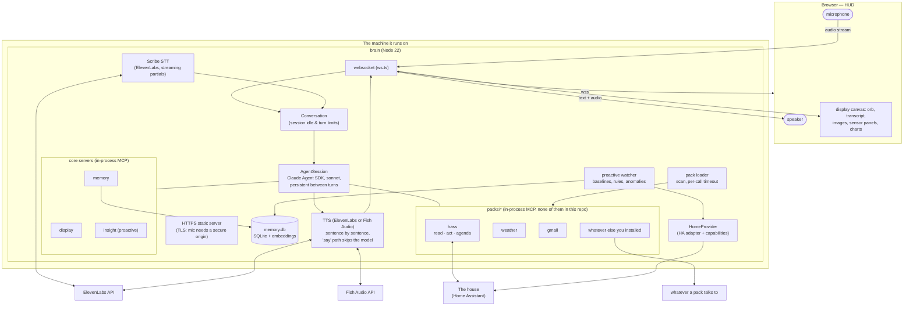
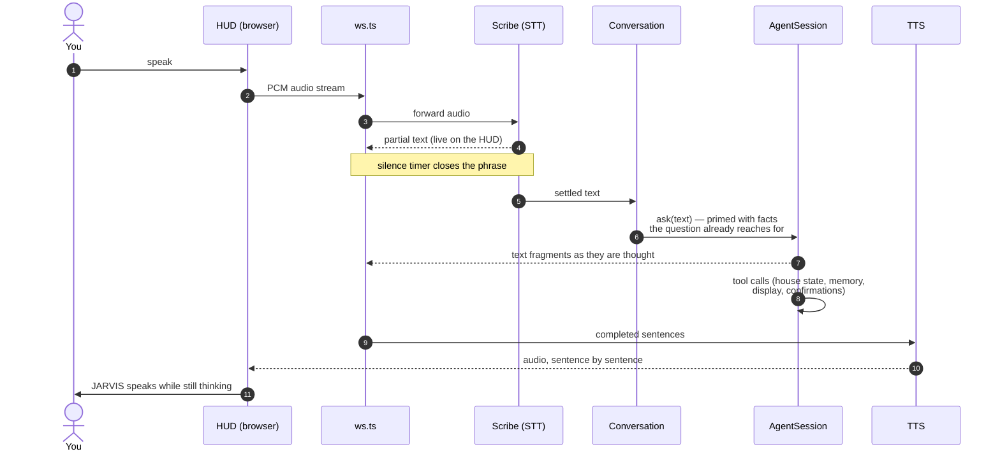
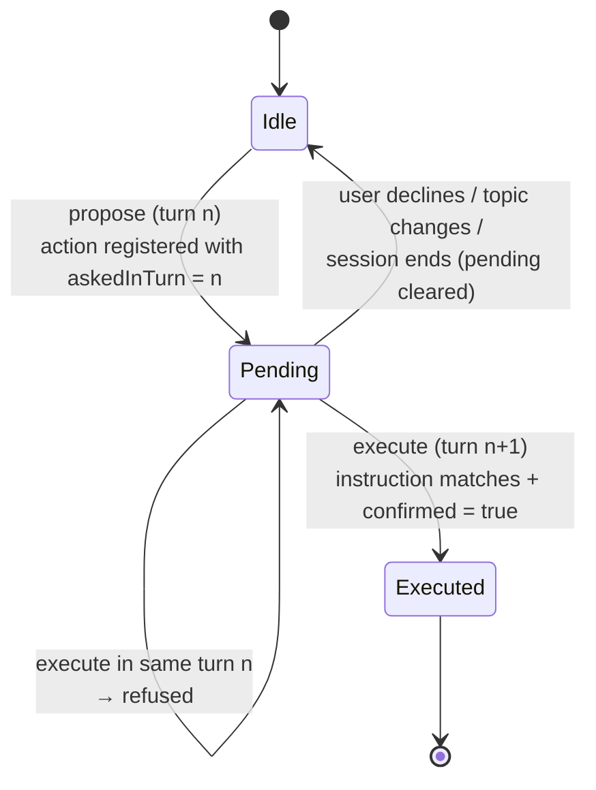
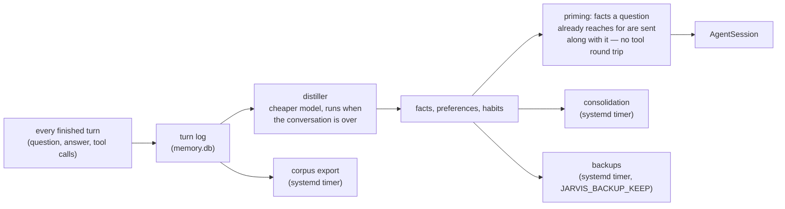
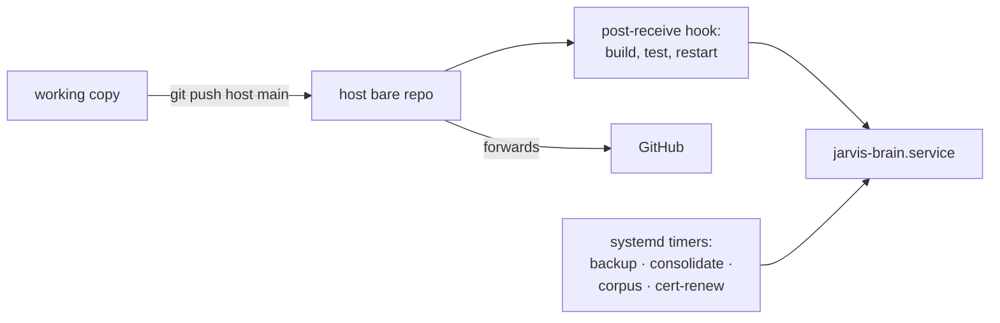

# Architecture

How the pieces of JARVIS fit together, in diagrams. The prose lives in the
the [README](../README.md); this page is the map.
Running it -- deploy paths, credentials, state and schedules -- has its own page in
[operations.md](operations.md).

## System overview

A deployment may also have helpers that talk to the house directly, without going
through the brain at all — scheduled tasks on a workstation, say, that follow its
lock state. They cost no tokens and keep working while the brain is down. Those
live outside this repository, as packs of their own under `packs/`.

## A voice turn

## Spoken confirmation — two turns, always

Anything that secures the house -- locks, alarm, door openers -- uses this
two-step contract, and so does every private pack that guards something. The
model cannot fake a turn boundary: the pending action records the turn it was
proposed in, and the confirming call must arrive in a **later** turn. The state
lives in the closure the pack's `create` returned, so it dies with the
conversation it was asked in.

## Memory pipeline

## Deploy and operations

The host is the source of truth; GitHub is downstream. Pushing to GitHub does
**not** deploy.

