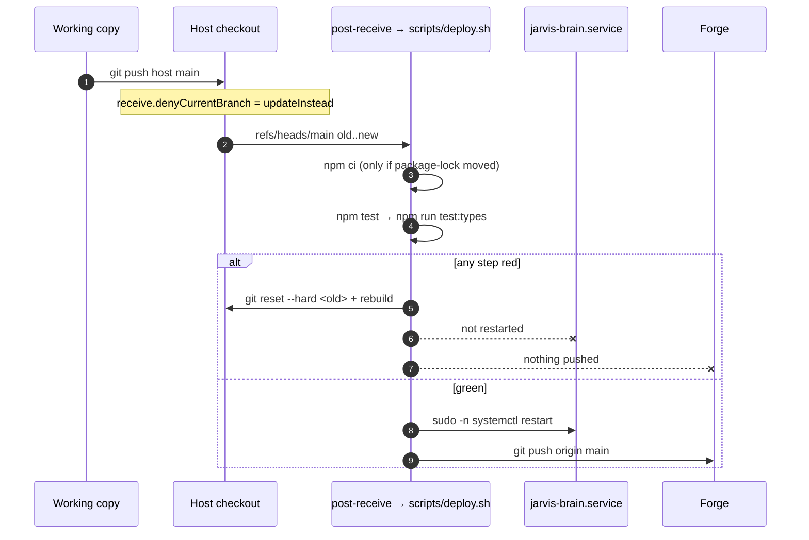
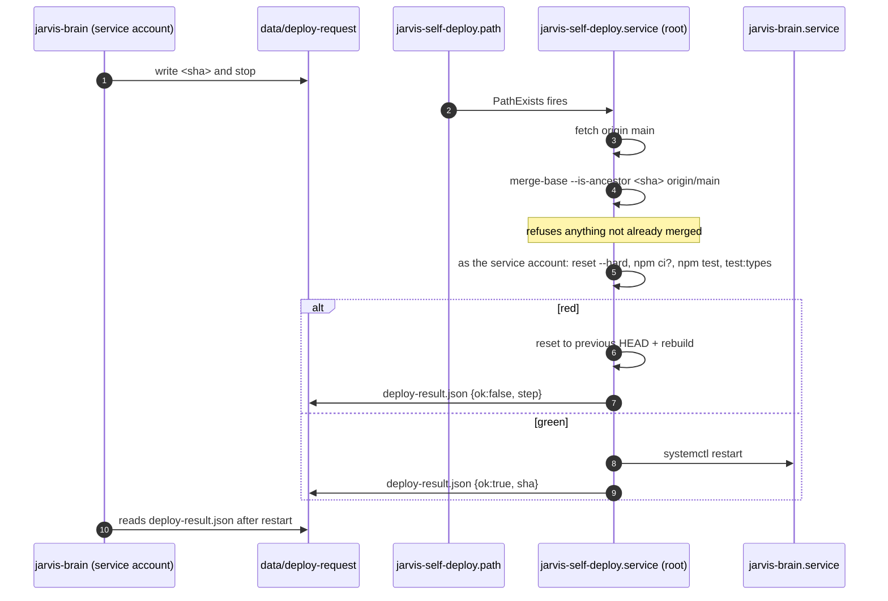
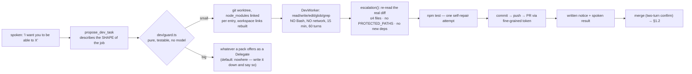
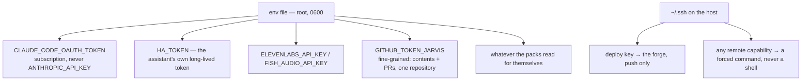

# Operations

Companion to [architecture.md](architecture.md), which maps the software. This page is about running
it: how code reaches the service, who holds which credential, what state exists and for how long,
what fires on its own, and what each external dependency looks like when it breaks.

Written from one working deployment. The shapes are general; the numbers in it are that
deployment's, and yours will differ.

---

## 1. Deploy paths

Three ways code reaches the running service. **The host is the source of truth in all of them** — a
push to a forge never deploys.

### 1.1 Push to deploy



The hook is a five-line stub that **copies** `scripts/deploy.sh` to a temp file before running it — a
rollback rewrites that script while bash is still reading it. The deploy logic is versioned; only the
stub and `receive.denyCurrentBranch` live outside the repository.

The host goes first and the forge second because only the host holds a key with write access. That
ordering is what makes a red suite mean "nothing happened" rather than "it is on GitHub but not
running".

Four things a push does **not** carry, and must reach the host some other way: the env file,
`config/persona.md`, `config/seeds/` and `config/packs.json`. All four are ignored here on purpose.

### 1.2 Self-deploy — restarting on code it wrote

The brain runs with `NoNewPrivileges=yes` and cannot restart anything. The privilege boundary is a
**single 40-character string in a file**.



Everything git and npm touch runs as the service account via `runuser`; only the restart is root. The
answer comes back as a file because the process that asked for it no longer exists by the time it
lands.

### 1.3 What produces that sha



The guard's protected list is not "risky-looking files" — it is *everything that can move a
boundary*: `brain/src/dev/`, `packs/` wholesale — the house's confirmation guard with it — `scripts/`,
`deploy/`, `.github/`, every `package.json` and the lockfile. Daily budget: five small fixes.

### 1.4 CI — second opinion, never a gate

`.github/workflows/fat.yml` runs `npm ci → npm test → npm run test:types` for every push to `main`.
No house, no tokens, no network. The host already ran the same suite *before* the push, so CI
confirms rather than authorises. `.github/workflows/no-house-facts.yml` runs alongside it and fails
if a household fact reached the tree.

---

## 2. Identity, credentials and privilege

Everything secret is in one root-owned env file that systemd reads on the units' behalf. The service
account never reads it directly, and nothing secret is in this repository or in any commit.



Rules that hold this together, in order of how much they buy:

1. **Every remote capability is a forced command, never a shell.** A brain that rewrites its own
   source must not be able to grow a shell on another machine.
2. **The worker agent has no `Bash`.** The SDK confines its file tools to the worktree; with no shell
   it cannot reach a key, cannot push, cannot curl.
3. **A deploy key cannot open a pull request** — that needs the REST API and a user token, which is
   why a fine-grained token exists and is scoped to one repository.
4. **Credentials for somebody else's systems do not live here.** A pack that needs them is a
   repository of its own, cloned into `packs/`, and what it holds is its own.

---

## 3. Data, state and retention

| What | Where | Lifecycle |
|---|---|---|
| Memory database | `data/memory.db` (WAL) | Checkpoint-truncated on a timer; facts keep revisions, consolidation merges weekly |
| Backups | `data/backups/` | `VACUUM INTO` nightly, `JARVIS_BACKUP_KEEP` retained |
| Corpus copy | `data/corpus/` | Replaced nightly, whole-directory swap, refuses a transfer that looks truncated |
| Deploy handshake | `data/deploy-request`, `data/deploy-result.json` | Written by the brain, consumed and answered by the root one-shot |
| Throwaway worktrees | `JARVIS_DEV_WORKTREES` | One per attempt, removed on any failure |
| TLS material | `JARVIS_CERT_DIR` | The key readable by the service account only; renewed on a timer |

⚠️ `loadConfig()` resolves relative paths against the *current working directory*. A CLI run from the
wrong directory will silently create a second, empty database. The CLIs `chdir` into `brain/` for
exactly this reason; anything new should do the same.

⚠️ Backups are plaintext SQLite on the same disk as the original, and they contain everything the
assistant knows about the household. An off-host copy and encryption at rest are both worth having
and neither is provided here.

---

## 4. Schedules

```mermaid
gantt
    title A day, in the host's local time
    dateFormat HH:mm
    axisFormat %H:%M
    section systemd timers
    memory backup (VACUUM INTO)      :02:30, 10m
    memory consolidation (weekly)    :03:00, 45m
    notes pull + ingest              :04:00, 20m
    cert renewal (weekly) + restart  :04:30, 30m
    section in-process
    baselines rebuild                :03:50, 5m
    rules + self-checks (hourly, :06):00:06, 24h
    rollup tick (every 60 s)         :00:00, 24h
```

The ordering is deliberate: the backup lands before the consolidation that deletes facts, and the
note ingest lands after both, so a pass that writes facts never overlaps the pass that merges them.
Timers carry `RandomizedDelaySec` and `Persistent=true`.

All four name `__JARVIS_TIMEZONE__`, which `scripts/install-units.sh` fills in from
`JARVIS_TIMEZONE` or, failing that, the machine's own zone. They have to agree: on a host
whose clock is UTC, a mixture puts the note ingest at 02:00 UTC and the consolidation at
03:00 UTC, so the pass that writes facts runs before the pass that merges them — exactly
what the ordering exists to prevent.

Set the same zone in the service environment. The brain prints the zone it is reasoning in
at every startup, and opens a finding about itself when nothing named one and the machine
answered UTC.

One consequence worth knowing: the certificate renewal **restarts the brain** even when the renewal
itself was a no-op. That is a scheduled outage of a few seconds plus an embedding warm-up. Making the
restart conditional on the certificate file actually changing is a five-line `ExecStartPost`
condition, and is on the list below.

---

## 5. External dependencies and what their failure looks like

| Dependency | Protocol | Credential | Timeout | Failure mode |
|---|---|---|---|---|
| The house | REST + websocket | Own long-lived token | 15 s REST, 30 s WS request and ping | Tools error politely; the proactive socket reconnects with backoff 1→60 s; the rollup pauses, so a gap is not read as a quiet house |
| Anthropic (Agent SDK) | HTTPS | `CLAUDE_CODE_OAUTH_TOKEN` | SDK | No conversation at all. Token expiry is the classic outage |
| ElevenLabs | websocket | API key | 8 s to connect | Voice unavailable → the HUD falls back to browser speech; credit balance cached 5 min. Transcription is always ElevenLabs |
| Fish Audio | websocket, MessagePack | API key | 8 s to connect | Same fallback. A socket that closes before the first sentence is reopened on it; one that dies mid-sentence fails the turn. The free model is not metered, so no balance is asked |
| Forge API | HTTPS | Fine-grained token | 20 s | Branch pushes still work; no pull request opens — reported loudly, never silently |
| Whatever a pack talks to | its own | its own | its own | Its rows go `down` on the health panel; nothing else is affected |

Health probes run **on every HUD connection**, in parallel. Each pack declares a probe per server, and
servers sharing a backend share the function, so one dead dependency costs one timeout however many
servers it carries. A pack that is not running contributes no row: what a deployment was never
configured for is not a fault.

---

## 6. Observability

- **Logs**: journald, per unit. `journalctl -u jarvis-brain -f`. Note that the service account may
  not be in `adm`/`systemd-journal`, in which case a plain user read is filtered.
- **Health**: the HUD's own panel, from §5's probes. The house pill is that panel too — it says
  online, unreachable or not configured from the `ha` probe rather than from a constant.
- **The process**: the HUD's system panel, pushed over the websocket every five seconds —
  resident memory, CPU as a share of one core since the previous sample, disk, uptime and the
  duration of the last turn. Nothing there is estimated; what cannot be read shows as an em dash.
- **Ask the assistant itself**: the prompt carries a record of the deployment generated at startup —
  packs installed, running, off or not packs at all, what an off one is still missing, and which
  facilities core has. The `my_setup` tool returns that record with the §5 probes run there and then,
  which is the fastest way to find out why a capability is absent without reading the unit file. A
  directory under `packs/` with no `pack.json` is reported as what it is, usually build output a
  removed pack left behind; it used to be skipped in silence and look installed from the outside.
- **Metering**: every model call is written to the `usage` table; `node dist/usage-cli.js`.
- **The house**: `node dist/anomaly-cli.js` — open findings, `baselines <subject>`, `dry-run 48`.
- **Itself**: hourly invariant checks in the same `anomalies` table — a job that has not reported in
  or whose last run failed, counts that must not shrink, an observation feed no more than fifteen
  minutes stale, a timer that is enabled but not armed, a working copy matching what was pushed, and
  a time zone that was chosen rather than inherited from a UTC container. Deliberately run *outside*
  the house pass, because the evening the house is unreachable is exactly when they matter — and on a
  deployment with no house configured at all, they are the whole of the proactive side.

  A reading that could not be taken is no opinion, never an alarm — and neither is a decision. This
  machine's own answer to "should this run" is what systemd was told: a timer that was never enabled
  is silence, not a finding, and a job with neither a timer nor a single heartbeat is not expected to
  have run. The nightly baseline rebuild is the one job no timer speaks for, so it is expected only
  where there is a house. Half-configured pairs are the exception and do speak up, because a URL with
  no token is nobody's intention.

Nothing outside the assistant notices the assistant dying. Its notices come *from* it, so a dead
brain is a silent one. Whatever else watches your machines should watch this one too.

---

## 7. Known gaps

1. **The control surface has no authentication of its own.** Anything that can reach the port can
   drive the house, and there is no bind address to narrow it with -- the server listens on every
   interface the machine has. Keep the port on a private network, or put something that
   authenticates in front of it. Cheapest real win on this list. The memory panel ships at `read` rather than `edit` for this reason, which
   narrows the blast radius without closing it: the websocket still drives the house.
2. **Nothing outside notices an outage.** See §6.
3. **Backups are local and plaintext.** One copy to somewhere else, or verified coverage by whatever
   backs the host up.
4. **The OAuth token expires roughly monthly and takes everything with it.** The failure surfaces as
   "it stopped answering", which is a bad way to learn about it.
5. **Restart-on-certificate-renewal is a weekly blip** nobody asked for. See §4.
6. **No offline path**, deferred from the start. Every spoken interaction needs the internet, even
   "turn the light off". A local intent shortcut for the ten most common commands would survive a WAN
   outage — worth doing only if outages actually bite.

---

## 8. Recovery notes

- **Service will not start**: `journalctl -u jarvis-brain -n 50`. A missing certificate is the first
  suspect; the error names the exact command to run.
- **`status=226/NAMESPACE`, before node runs at all**: one of the directories in the unit's
  `ReadWritePaths` does not exist, and `ProtectSystem=strict` refuses to build the sandbox
  without it. The log names the directory. `scripts/install-units.sh` creates the four under
  the service user's home, so this means the unit was installed by hand or the home was
  cleared out; `install -d -o <user> -g <user> <dir>` and start it again.
- **Rolled-back deploy**: the checkout is already back on the previous commit and rebuilt; the
  service was never restarted. Fix forward and push again.
- **Self-deploy failure**: `data/deploy-result.json` names the step — `ancestry`, `install`, `tests`,
  `types` or `restart`.
- **Fresh host**: `git config receive.denyCurrentBranch updateInstead`, the `post-receive` stub,
  `JARVIS_TIMEZONE` in both the service environment and the install (they must match),
  a sudoers entry so the push may restart the unit (`NOPASSWD: /usr/bin/systemctl restart
  jarvis-brain.service`), `mkdir -p` the certificate directory and put a certificate and key
  in it, `scripts/install-units.sh`, the env file, `claude setup-token`, and the six paths
  git does not carry: the env file, `config/persona.md`, `config/seeds/`,
  `config/packs.json`, `data/` and `packs/`. `npm run packs-sync` refills the
  last one from the manifest, so it is the only one of the six that need not be copied.

  **Moving hosts is not cloning.** A clone gives you the program and none of the six. An
  assistant that starts with no memory and no persona will say so rather than fail, which is
  the design and also the reason a half-finished move is easy to miss. Copy `data/` before
  the first start, not after: the service creates an empty database on the way up and you
  will then be merging two.

  ⚠️ **Never `git clean -x` in the checkout.** All six are ignored, so `-x` is precisely
  what removes them. `git clean -fd` is the safe form.

  The certificate is the step with no default answer. The shipped renewal unit calls
  `tailscale cert`; anything that produces a certificate and a key will do, and a host that
  is not on a tailnet should leave `jarvis-cert-renew.timer` disabled and renew its own way.
  Without a certificate the browser refuses the microphone, so this is not optional.
